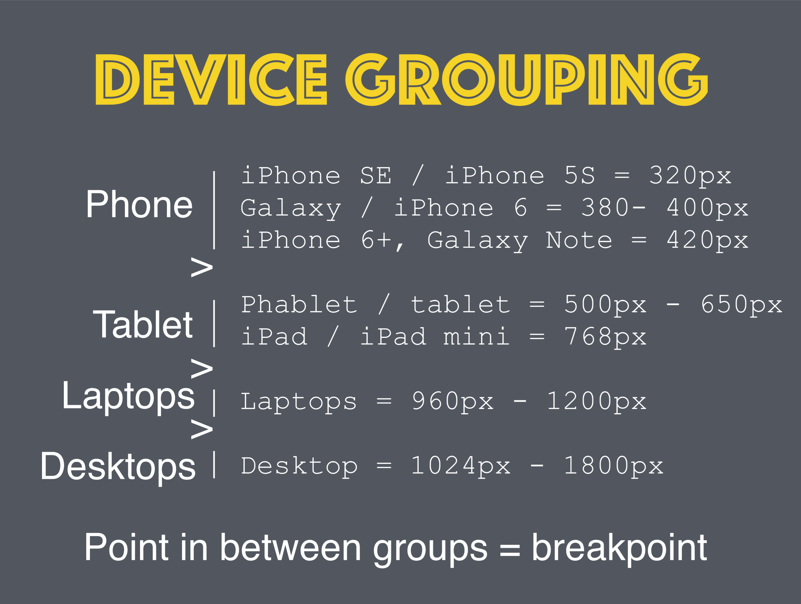

# Responsive Web Design

## Learning Objectives

- Explain the difference between a responsive website and a mobile-specific website.
- Use media queries to adjust styles for different viewport sizes.
- Compare mobile-first to desktop-first responsive design.
- List the different media query values and their conditions.
- Use the Chrome Dev tools to debug responsive CSS.

## Opening

### What is responsive design?

"Responsive Design" is the strategy of making a site that "responds" to the browser and 
device that it is being shown on... by looking awesome no matter what.

#### More devices

Not that long ago, building a successful online presence meant just ensuring that your 
website worked correctly in all the major desktop browsers.

Fast forward to today, and the desktop computer is dying, as more and more people own a 
smartphone:

- The number of active mobile devices and human beings crossed over somewhere around the 
  [7.19 billion 
  mark](http://www.independent.co.uk/life-style/gadgets-and-tech/news/there-are-officially-more-mobile-devices-than-people-in-the-world-9780518.html).
- New devices like iWatches are changing the game too
- "Having a mobile friendly website is no longer just important, it’s critical.", [Forbes 
  Ecommerce Marketing Checklist for 
  2013](http://www.forbes.com/sites/brentgleeson/2013/03/14/ecommerce-marketing-checklist-for-2013/)

### Responsive Matters

- Google will ding you if your pages are not built responsively.
- More importantly, your customers will ding you!
- After today, everything you build in this class **should be** responsive.

## Prerequisites

- [Specificity in CSS - Intro](CSS-Specificity.md)
- Screen Resolution

## Audience Participation (5 mins)

**What are the most common dimensions for a website design?**

Why don't you tell me! http://screensiz.es

## How to do Responsive Design wrong - Demo 

If you're not planning before you begin to create a responsive design, you'r doing it 
wrong. Changing a web platform to a mobile platform is much more difficult than going from 
mobile to web.

#### Examples of non-responsive sites:

It is becoming harder and harder to find non-responsive websites. But here is an example 
of a [non-responsive 
website](https://dequeuniversity.com/library/responsive/1-non-responsive) for you to try 
out.

#### Examples of mobile specific sites:
One way to create optimal experiences for mobile users is a dedicated mobile site.

You know you're on one when you see `m.` in the url!

Compare https://m.xkcd.com with https://xkcd.com


Avoid these... please.

#### Examples of responsive sites:

- [Boston Globe](http://www.bostonglobe.com/)  
- [GA](https://generalassemb.ly/)
- [Responsive Meme](http://responsivememe.webflow.io/)


What's the difference between these? Let's resize again.
Interestingly, **Boston Globe was the first example of a responsive website.**

Instead of manually resizing the page, which can be a pain, we can use Google Chrome 
DevTools.


**Chrome DevTools in Action:**

- Let's visit GA's homepage
- Click on the device icon next to the magnifying glass
- You can change the pixel width (displayed at the top) using the drag tool
- You can select any device using the dropdown menu at the top

## Turn and Talk - Lab (10 min)

What makes a design fixed? What makes a design fluid? What makes a site responsive?

Check out [mediaqueri.es](http://mediaqueri.es) for inspiration.

## Make a responsive website - Codealong

Download the [starter-code](starter-code)

Now open everything in VS Code and add the contents of a [reset.css](http://cssreset.com/) 
to the reset stylesheet.

#### Add some HTML

Now let's add some html into the index.html file:

```html
<!DOCTYPE html>
<html>
<head>
  <title>Responsive design</title>
  <link href='http://fonts.googleapis.com/css?family=Montserrat:400,700' rel='stylesheet' type='text/css'>
  <script type="text/javascript" src="./js/app.js"></script>
  <link rel="stylesheet" type="text/css" href="./stylesheets/reset.css">
  <link rel="stylesheet" type="text/css" href="./stylesheets/style.css">
</head>
<body>
  <header>
    <nav>
      <ul>
        <li><h1>Responsive Design</h1></li>
        <li>Like normal design, but responsive.</li>
        <li><span>So many</span> devices</li>
        <li>
          <ul>
            <li><a href="/">Desktop</a></li>
            <li><a href="/">Phone</a></li>
            <li><a href="/">iPad</a></li>
            <li><a href="/">iWatch</a></li>
          </ul>
        </li>
      </ul>
    </nav>
  </header>
  <main>
    <div class="column">
      <h2>Exciting content</h2>
      <p>Web development is so fun...</p>
    </div>
    <div class="column">
      <h2>More content</h2>
      <p>Device testing is quite tedious...</p>
    </div>
    <div class="column">
      <h2>Even more content</h2>
      <p>But it has to be done now...</p>
    </div>
  </main>
</body>
</html>
```
And then add some CSS:

```css
* {
  box-sizing: border-box;   
  margin: 0px;  
  padding: 0px;  
}

body {
  font-family: 'Montserrat', sans-serif;
  color: black;
}

header, main {
  width: 960px;
  margin: 0 auto;
  position: relative;
}

/* HEADER */

header nav ul li {
  overflow: hidden;
}

header nav > ul > li:nth-child(1) h1 {
  color: rgb(242, 138, 40);
  text-transform: uppercase;
  font-weight: 700;
  font-size: 88px;
}

header nav > ul > li:nth-child(2) {
  height: 35px;
  padding: 0 10px;
  font-size: 23px;
  line-height: 35px;
  color: #ffc719;
  background: black;
}

header nav > ul > li:nth-child(3) span {
  color: #ff0044;
  text-transform: uppercase;
  font-weight: 700;
  padding: 10px;
  font-size: 25px;
  display: inline-block;
}

header nav > ul > li:nth-child(4) {
  background: rgb(241, 241, 241);
  margin-bottom: 15px;
}

header nav > ul > li:nth-child(4) ul li {
  display: inline;
}

header nav > ul > li:nth-child(4) a {
  padding: 15px;
  display: inline-block;
  color: black;
  text-decoration: none;
}

header nav > ul > li:nth-child(4) a:hover {
  background: #ffc000;
}

/* MAIN COLUMNS */
main .column h2 {
  padding: 15px;
  color: white;
}

main .column:nth-child(1) h2 { background: rgb(126, 211, 33);}
main .column:nth-child(2) h2 { background: rgb(235, 91, 76); }
main .column:nth-child(3) h2 { background: rgb(0, 174, 255); }

main .column p {
  padding: 15px;
}
```


#### Make the columns responsive

How do we go about splitting these columns across the page?

Where the CSS for the columns have been defined (at the bottom) let's add:

```css
main .column {
  float: left;
  width: 33.33%;
}
```

#### Adjusting the container width

If we try and resize the page - nothing. This is because the contain element has a fixed width. Let's change the css for the main selector:

```css
header, main {
  max-width: 960px;
  margin: 0 auto;
  position: relative;
}
```

Let's test!

It works, but the text gets squished. This will not look good when there is lots to read.

#### Setting a min-width

Let's set a min-width instead to prevent this:

```css
main .column {
  float: left;
  width: 33.33%;
  min-width: 320px;
}
```

When there is not enough space for the 320px element to fit, it will now flow underneath 
the element to it's left, starting from the right to the left.

#### Why 320px?  

That's the width of an iPhone 3G.

Okay, so that looks good when the screen is small and large but what about in the middle?

## Media queries - Intro

In order to target specific device/screen sizes, we need to use media-queries.

What the heck is a media query? From 
[MDN](https://developer.mozilla.org/en-US/docs/Web/CSS/Media_Queries/Using_media_queries):

"A media query consists of a media type and at least one expression that limits the style 
sheets' scope by using media features, such as width, height, and color."

As there are lots of different devices, there can be lots of different media-queries.

- [CSS-Tricks](https://css-tricks.com/snippets/css/media-queries-for-standard-devices/) is 
  a good resource for reading up and refreshing yourself on media-queries.

## Using media queries - Codealong

One way of doing this is by including `media` in your stylesheet link.

```html
<link rel='stylesheet' media='screen and (min-width: 701px) and (max-width: 900px)' href='css/medium.css' />
```

Other possible values include:

```
/* these are most commonly used */
min-width | max-width | min-height | max-height
```

But this is not very cool. A better way is to include in your CSS. This is the syntax:

#### Max-width 960px

```css
@media only screen and (max-width: 960px) {  
  /*style*/
}
```

This will apply style only when this condition is true.

We include this at the bottom of the page.

```css
@media only screen and (max-width: 960px) {  
  main .column {
    width: 50%;
  }
  main .column:last-child {
    width: 100%;
  }
}
```

Specificity still applies. So if we didn't add `main` then this still wouldn't be as specific as the one above.

#### Max-width 640px

This looks good when the window is greater than 640px, but we'll need to add one more media query for when the window is smaller than this.

```css
@media only screen and (max-width: 640px) {
  main .column {
    width: 100%;
  }
}
```

Let's test! Great!


#### Style the header

Our columns are now working but we need to do a little bit of work on our header.

Sometimes, with responsive design, we have to decide to omit content from a site. This can sometimes mean that we are loading content on the mobile device that the user can't see - that will slow their page down - however, for this example, we will not worry about that.

```css
@media only screen and (max-width: 960px) {
  header nav ul li {
    display: none;
  }
}
```

If we resize the page, everything in the header disappears. Let's just show the first li with the header and the last one with the menu:

```css
@media only screen and (max-width: 960px) {  
  header nav ul li {
    display: none;
  }

  header nav > ul > li:nth-child(1),
  header nav > ul > li:nth-child(4) {
    display: block;
  }
}
```

This is a _little_ better.

#### Title

Now we want the title to change size depending on the browser size. Let's do the middle size first:

```css
@media only screen and (max-width: 960px) {  
  header nav ul li {
    display: none;
  }

  header nav > ul > li:nth-child(1),
  header nav > ul > li:nth-child(4) {
    display: block;
  }

  header nav > ul > li:nth-child(1) {
    text-align: center;
    padding: 30px 0;
  }

  header nav > ul > li:nth-child(1) h1 {
    font-size: 40px;
  }
}
```

Now, let's do the smaller browser:

```css
@media only screen and (max-width: 640px) {
  header nav > ul > li:nth-child(1) {
    text-align: center;
    padding: 15px 0;
  }

  header nav > ul > li:nth-child(1) h1 {
    font-size: 30px;
  }
}
```


#### Adding a hamburger menu

The issue we have is the menu. When we get to a small size, there isn't enough room for all of the links.

We are going to have to add a new "burger icon". There are a number of different ways to do this - we'll try it with a text icon. Let's add another `li` to the `nav ul`:

```html
<li><a href="#"></a></li>
```

And let's style this with CSS.

```css
@media only screen and (max-width: 640px) {

  header nav > ul > li:nth-child(4) ul li:nth-child(1) {
    float: right;
    display: block;
  }

  header nav > ul > li:nth-child(4) ul li:nth-child(1) a:before {
    content:'\2630';
    font-size: 16px;
  }

}
```

Let's have a look at this. All of the `li` elements will be block level.

Now we want to hide all of the lis except the first one:

```css
@media only screen and (max-width: 640px) {

  header nav > ul > li:nth-child(4) ul li {
    display: none;
  }

}
```

Now we need to add some jQuery to make the navigation bar slide up and down.

First, we need to add jQuery into the index.html:

```html
  <script src="https://ajax.googleapis.com/ajax/libs/jquery/2.1.3/jquery.min.js"></script>
  <script type="text/javascript" src="./js/app.js"></script>
```

Now let's add some jQuery to app.js:

```javascript
$(function(){
  $('header nav > ul > li:nth-child(4) ul li:nth-child(1)').on('click', function(){
    event.preventDefault();
    $(this).siblings().slideToggle();
  });
})
```

So now, we should have a responsive site!

If you get some issues with when the browser window changes size, you might need to add some `!important` tags to make sure that the browser uses the right selector.


## Device Grouping & Breakpoints



---


## On your phone - Codealong

Well if we want to check out the site, we'd have to upload the file to a web server; but this will be a pain, so let's run a little server from our computers and check out our site on our phones.

Run the following in the folder where you saved your index.html  

```bash
python -m SimpleHTTPServer  
```

To check it out on your computer go to:

```
http://localhost:8000
```

Great you are running a simple web server!

If your computer and phone share the same WiFi network, you can check out the site on your phone.  First, we need the ip address of our computer.

Type in `ifconfig` in the terminal. There should be something like:

```bash
inet 10.0.1.85
```

On your phone if you goto:

```
http://10.0.1.85:8000
```

and you should see your awesome website.

#### Meta viewport

Well, it will probably look like it does on your desktop.

Mobile devices are clever: they pretend they have a width of 960px and scale the website.  We need to override this and force the mobile to respond to our media queries.


Put the following code into our header.

```html
<meta name="viewport" content="width=device-width, initial-scale=1.0">
```

Now, recheck to see your awesome, responsive website!

## Flexible Images

We need images that fit their containers.  By default, images will try to take up as much 
space as it's initial dimensions. This can cause some pain when you size up and size down 
your picture, especially if you are trying to control the size of your elements via a 
parent `div`.

It turns `max-width: 100%` is the answer. Most of the time. For any media.

Even as our flexible container resizes, shrinking or enlarging our image, the image’s 
aspect ratio remains intact.

```css
img,
embed,
object,
video {
  max-width: 100%;
  height: auto;
}
```

## Conclusion

As noted earlier in the lesson, since mobile is increasingly becoming the user default, any project should consider mobile styling from the start.  

Also, note that images and tables are often difficult to make responsive.

Since images sometimes stretch or "squish", `max-width` is your friend. Sometimes it may be more sensible to serve different images for different devise sizes: a 1200px image doesn't make sense to load on a mobile device.

Though we won't cover this explicitly in this lesson, consider this while your building in the future.

## Audience Participation (5 mins)

- Describe media queries.
- Identify the different tools you can use to practice responsive design.
- What are the steps to ensure mobile devises are using media queries when loading your web app?
- How do we "and" two media queries?
- How do we "or" two media queries?
- What does the "not" keyword do?
- Do the order of the media queries matter?
- What is the name of the design pattern where the initial designs support mobile, then we 
  move to larger devices?

## Media Queries - Lab (15 min)

### Step 1

Working with the example below, create a [jsfiddle](https://jsfiddle.net/), 
[codepen](http://codepen.io/pen/), or [webpage](http://justinjackson.ca/words.html) that 
includes at least two media queries.

```css
body{
  background: papayawhip;
}

@media (max-width: 400px){
  body{
    background: tomato;
  }
}
```

When the viewport is less than 800px wide, make the background yellow. When the viewport 
is less than 400px wide, make the background green.


### Step 2

Try out a few of the properties above. You can combine media queries to get several 
different results.

i.e. what combination of media queries could produce the following grid as the viewport 
changes size?

| green     | yellow | red    |
|-----------|--------|--------|
| turqouise | green  | purple |

[Like this.](http://recordit.co/UfnuMHQbWa)


## 007 Exercise - Lab (30 mins)

**Pair Program This Exercise**

https://github.com/wdi-infinity/responsive_007

## Resources

- The post that introduced us to [responsive web design](http://alistapart.com/article/responsive-web-design)
- http://screensiz.es
- http://mediaqueri.es
- Media Query [Logical Operators](https://developer.mozilla.org/en-US/docs/Web/CSS/Media_Queries/Using_media_queries#Logical_operators)
- [Logic in Media Queries](https://css-tricks.com/logic-in-media-queries/)
- [Viewports](http://www.quirksmode.org/mobile/viewports.html)
- Book: [Responsive Web Design, Ethan 
  Marcotte](https://abookapart.com/products/responsive-web-design)
